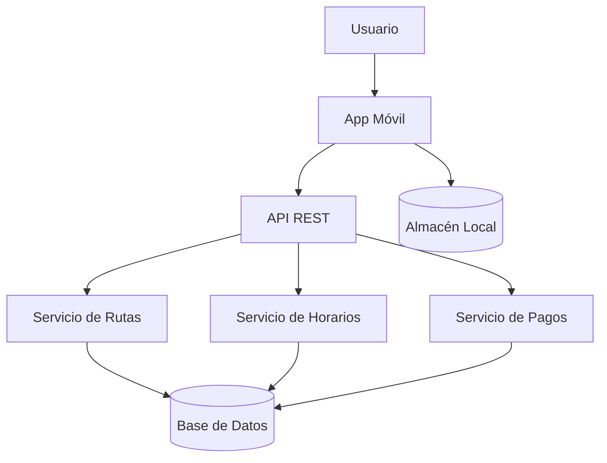

# 🚌 Transporte Público de Arequipa


Una aplicación móvil que permite a los ciudadanos de Arequipa consultar rutas de transporte público, horarios en tiempo real, y realizar pagos electrónicos de pasajes de forma rápida y eficiente.

## Tabla de contenidos

- [Descripción](#descripción)
- [Instalación](#instalación)
- [Uso](#uso)
- [Estado de funcionalidades](#estado-de-funcionalidades)
- [Tareas pendientes](#tareas-pendientes)
- [Arquitectura](#arquitectura)
- [Contribuidores](#contribuidores)
- [Errores comunes](#errores-comunes)
- [Observaciones](#observaciones)
- [Conclusiones](#conclusiones)

## Descripción

Esta aplicación fue diseñada para mejorar la experiencia de los usuarios del sistema de transporte público de la ciudad de Arequipa. Permite a los pasajeros acceder a información actualizada sobre líneas de transporte, tiempos de espera estimados, y opciones de pago digital, eliminando la necesidad de llevar efectivo y facilitando la movilidad urbana.

## Instalación

```bash
git clone https://github.com/jeissonparedes/transporte-publico-arequipa.git
cd transporte-publico-arequipa
npm install
cp .env.example .env
npm run migrate
```

## Uso

```bash
npm start
# La aplicación estará disponible en http://localhost:3000
```

Para ejecutar las pruebas:

```bash
npm test
```

Para generar el build de producción:

```bash
npm run build
```

## Estado de funcionalidades

| Función | Estado |
|---|---|
| Consulta de rutas | Listo |
| Horarios en tiempo real | Listo |
| Mapa interactivo de paradas | En progreso |
| Pago electrónico de pasajes | En progreso |
| Notificaciones push | Pendiente |
| Modo offline | Pendiente |

## Tareas pendientes

- [x] Diseño de la base de datos
- [x] API de consulta de rutas
- [ ] Integración de pasarela de pago
- [ ] Implementación de mapa interactivo
- [ ] Sistema de notificaciones push
- [ ] Pruebas unitarias completas
- [ ] Modo offline con almacenamiento local
- [ ] Despliegue en producción

## Arquitectura



## Contribuidores

- **Jeisson Daniel Paredes Cano** — [jeissonparedes](https://github.com/jeissonparedes)
- **Carlos Alberto Mamani Condori** — [cmamani-dev](https://github.com/cmamani-dev)
- **Ana Lucía Flores Chávez** — [anaflores-dev](https://github.com/anaflores-dev)
- **Marco Antonio Rivera Quispe** — [mrivera-dev](https://github.com/mrivera-dev)

---

*Documento desarrollado como parte del Laboratorio 05 - Markdown Avanzado y README Profesional.*
